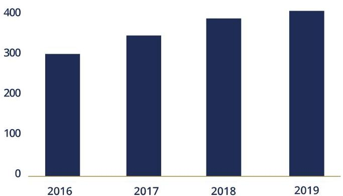
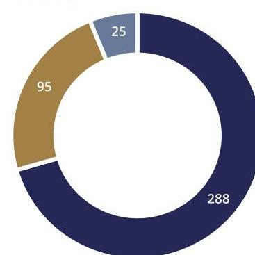
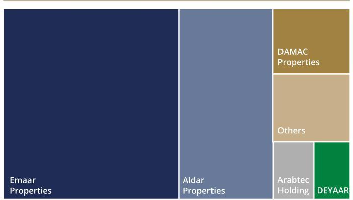

## BANKS' EXPOSURE TO REAL ESTATE

UAE banks' loan exposure to real estate reached AED 408.1 billion in 2019 with a growth rate of 7.9\% compared to $8.2 \%$ in 2018. Exposure to completed real estate projects represents $70.5 \%$ of banks' total real estate loan exposure.

## CHART 1.4.5: UAE BANKING SYSTEM REAL ESTATE LOAN EXPOSURE

## AED

billion
500

Source: CBUAE

## CHART 1.4.6: REAL ESTATE EXPOSURE BY CATEGORY

## AED Billion

## - Completed   - Construction   - Working Capital

## Source: CBUAE

The Central bank of the UAE (CBUAE) uses macroprudential instruments to ensure and promote financial stability in the UAE. To reduce the build-up of systemic vulnerabilities, the CBUAE introduced regulations regarding mortgage loans in $2013^{17}$. As a response to the COVID-19 pandemic, in March 2020, CBUAE relaxed its Loan-to Value ratio by 5\% for first house/owner occupied buyers. The intervention means that maximum loan to value ratios stand as follows:

TABLE 1.4.1: MAXIMUM LOAN TO VALUE SCHEDULE

|  | UAE National | Expatriates |
| :-- | :--: | :--: |
| First house/owner occupier |  |  |
| Value equal or less   than AED 5 million | $85 \%$ | $80 \%$ |
| Value equal or greater   than AED 5 million | $75 \%$ | $70 \%$ |
| Second House/ Investment   property | $65 \%$ | $60 \%$ |
| Off-plan | $50 \%$ | $50 \%$ |

In addition, the CBUAE will revise the existing limit which sets maximum exposure that banks can have to the real estate sector.

## REAL ESTATE DEVELOPERS FOCUS

Given the significance of the real estate sector to the UAE economy and declining prices in the past few years, publicly available financial statements of UAE real estate developers ${ }^{18}$ have been analysed assess the overall health of the sector. The real estate sector is dominated by the duo Emaar Group and Aldar Properties, representing around 80\% of the sector's market capitalisation.

## CHART 1.4.7: REAL ESTATE COMPANIES BY MARKET CAPITALIZATION

Source: Bloomberg
The profitability of the sector as a whole remained healthy, mainly driven by strong earnings registered by Emaar Group and Aldar Properties with a slight uptick during 2019 measured by positive Return On Assets (ROA) and Return on Equity (ROE). However, the number of loss-generating corporates among the sample companies have also continued to increase.

[^0]
[^0]:    ${ }^{17}$ A mortgage loan is a loan that is collateralized against a residential property granted for the purpose of constructing, purchasing or renovating a house for owner occupied or investment purposes. It also includes loans granted for the purchase or the